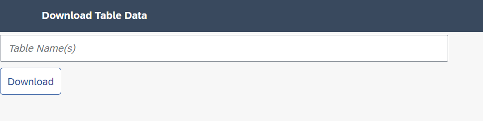
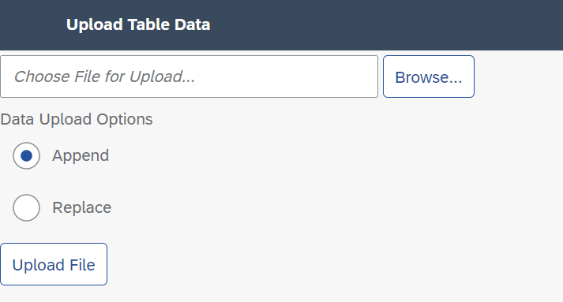

# Download and Upload of Table Data for SAP BTP ABAP Environment
This Git repository provides an utility to download and upload table data from one [SAP BTP ABAP Environment](https://community.sap.com/topics/btp-abap-environment)  (aka "Steampunk") system to another system. The code is compliant to [ABAP Cloud](https://community.sap.com/topics/abap) and can also be used in SAP S/4HANA Cloud, public edition.

The utility consists of two http services (URLs), one to **download** data and the other one to **upload** data. A *SAP UI5* web page is provided for both features.

The utility supports only *custom-defined* database tables, but not SAP-delivered database tables. All types of database tables are supported. Please consider the implications if you are upload data of client-independent tables, configuration or system tables.

You can specify one or more database tables for the **download**. A search-as-you-type feature is supported for the first table name. The xml format is used as file format for the download. The created files are only intended and optimized for the upload by the same utility. It is not posible to process the data with other tools. 

When **upload** the data, you can specify whether the data should be *appended* only or whether the data in all tables to be uploaded should be deleted before the upload - which means to be *replaced*.

Please grant the authorizations for the utility carefully. Only the start authorization of the http services is checked. There is no further authorization check on table level. This utility is intended to be used by adminstators or key users only.

## Prerequisites
Make sure to fulfill the following requirements:
* You have access to an SAP BTP ABAP Environment instance (see [here](https://discovery-center.cloud.sap/serviceCatalog/abap-environment?region=all) or [here](https://help.sap.com/docs/sap-btp-abap-environment) for additional information).
* You have downloaded and installed ABAP Development Tools (ADT). Make sure to use the most recent version as indicated on the [installation page](https://tools.hana.ondemand.com/#abap). 
* You have created an ABAP Cloud Project in ADT that allows you to access your SAP BTP ABAP Environment instance (see [here](https://help.sap.com/viewer/5371047f1273405bb46725a417f95433/Cloud/en-US/99cc54393e4c4e77a5b7f05567d4d14c.html) for additional information). Your log-on language is English.
* You have installed the [abapGit](https://github.com/abapGit/eclipse.abapgit.org) plug-in for ADT from the update site `http://eclipse.abapgit.org/updatesite/`.

## Download
Use the abapGit plug-in to install the **Download and Upload of Table Data** by executing the following steps:
1. Optional, but recommended if two different systems are involved: Open the Administrator's Fiori Launchpad and start the app **Maintain Software Components**. Create a new software component `ZDBTAB_DATA` of type *Development*. Press the button *Clone* which creates the software component and the stucture package with the same name `ZDBTAB_DATA` in the respective ABAP system (see [here](https://help.sap.com/docs/sap-btp-abap-environment/abap-environment/how-to-create-software-components) for additional information).
2. In your ABAP cloud project, create the ABAP package `ZDBTAB_DOWN_AND_UPLOAD` (using the superpackage `ZDBTAB_DATA`) as the target package for the utility to be downloaded (leave the suggested values unchanged when following the steps in the package creation wizard).
3. To add the <em>abapGit Repositories</em> view to the <em>ABAP</em> perspective, click `Window` > `Show View` > `Other...` from the menu bar and choose `abapGit Repositories`.
4. In the <em>abapGit Repositories</em> view, click the `+` icon to clone an abapGit repository.
5. Enter the following URL of this repository: `https://github.com/frankjentsch/dbtab-down-and-upload.git` and choose <em>Next</em>.
6. Select the branch <em>refs/heads/main</em> and enter the newly created package `ZDBTAB_DOWN_AND_UPLOAD` as the target package and choose <em>Next</em>.
7. Create a new transport request that you only use for this utility installation (recommendation) and choose <em>Finish</em> to link the Git repository to your ABAP cloud project. The repository appears in the abapGit Repositories View with status <em>Linked</em>.
8. Right-click on the new ABAP repository and choose `Pull ...` to start the cloning of the repository contents. Note that this procedure may take a few seconds. 
9. Once the cloning has finished, the status is set to `Pulled successfully`. Refresh the `abapGit Repositories` view to see the progress of the import. Then refresh your project tree. 

As a result of the installation procedure above, the ABAP system creates an inactive version of all artifacts for the utility. Further manual steps are required to finally use the utility. Please refer to the next section.

## Configuration

To activate all development objects from the `ZDBTAB_DOWN_AND_UPLOAD` package: 
1. Click the mass-activation icon (<em>Activate inactive ABAP development objects</em>) in the toolbar.  
2. In the dialog that appears, select all development objects in the transport request (that you created for the utility installation) and choose `Activate`. 

To test the utility in the development system:
1. At this point in time, the utility can be tested. Please open the respective http service in the editor.
2. Press the `URL` link to open the browser with download or upload feature.

To create the actual objects for the Identity and Access Management (IAM):
1. Right-click on the package `ZDBTAB_DOWN_AND_UPLOAD` in the project explorer. Click `New` > `Other ABAP Repository Object`, start typing `iam` and select the object type `IAM App`. Create the first IAM App by entering Name `ZDBTAB_DOWNLOAD`, Description `Download Table Data`, Application Type `External App`. Navigate to tab `Services` and add `ZDBTAB_DOWNLOAD` of service type `HTTP Service`. Navigate to tab `Authorizations` and add the authorization object `S_APPL_LOG` with following authorization field values: ACTVT `Display`, ALG_OBJECT `ZDBTAB_DOWN_AND_UPLO`, ALG_SUBOBJ `DOWNLOAD`. Activate the IAM App. Press the button `Publish Locally`.
2. Repeat these steps for a second IAM App with Name `ZDBTAB_UPLOAD`, Description `Upload Table Data`, Application Type `External App`. Navigate to tab `Services` and add `ZDBTAB_UPLOAD` of type `HTTP`. Navigate to tab `Authorizations` and add the authorization object `S_APPL_LOG` with following authorization field values: ACTVT `Display`, ALG_OBJECT `ZDBTAB_DOWN_AND_UPLO`, ALG_SUBOBJ `UPLOAD`. Activate the IAM App. Press the button `Publish Locally`.
3. Right-click on the package `ZDBTAB_DOWN_AND_UPLOAD` in the project explorer. Click `New` > `Other ABAP Repository Object`, start typing `business` and select the object type `Business Catalog`. Create the first Business Catalog by entering Name `ZDBTAB_DOWNLOAD`, Description `Download Table Data`. Navigate to tab `Apps` and add IAM App `ZDBTAB_DOWNLOAD`. Activate the Business Catalog. Press the button `Publish Locally`.
4. Repeat these steps for a second Business Catalog with Name `ZDBTAB_UPLOAD`, Description `Upload Table Data`. Navigate to tab `Apps` and add IAM App `ZDBTAB_UPLOAD`. Activate the Business Catalog. Press the button `Publish Locally`.

To transport the finally completed utility:
1. Release the task and transport via ADT view `Transport Organizer`. As a result of this release, the developed object of that software component are written into a hidden Git repository.
2. Import the utility in a subsequent system: Open the Administrator's Fiori Launchpad of the subsequent system and start the app **Maintain Software Components**. Press the button *Clone* which imports all the released objects into the subsequent system.

To setup the authorization in a subsequent system:
1. Open the Administrator's Fiori Launchpad of the subsequent system and start the app **Maintain Business Roles**. Press `New` and enter Business Role ID `ZDBTAB_DOWNLOAD`, Business Role Description `Download Table Data`. Navigate to section `Assigned Business Catalogs` and add `ZDBTAB_DOWNLOAD`. Navigate to section `Assigned Business Users` and add all users to be able to **download** data.
2. Repeat these steps for a second Business Role with Business Role ID `ZDBTAB_UPLOAD`, Business Role Description `Upload Table Data`. Navigate to section `Assigned Business Catalogs` and add `ZDBTAB_UPLOAD`. Navigate to section `Assigned Business Users` and add all users to be able to **upload** data.

To show the created logs:
1. Open class `ZCL_DBTAB_APPLOG_SHOW`.
2. Press `F9` to run the class as console application. As a result, all logs about the download and upload activities are shown as console output of the last 24 hours. In order to show this data, the current user needs to have the respective S_APPL_LOG authorizations as explained above in the section to create the IAM Apps.

## How to obtain support
This project is provided "as-is": there is no guarantee that raised issues will be answered or addressed in future releases.
